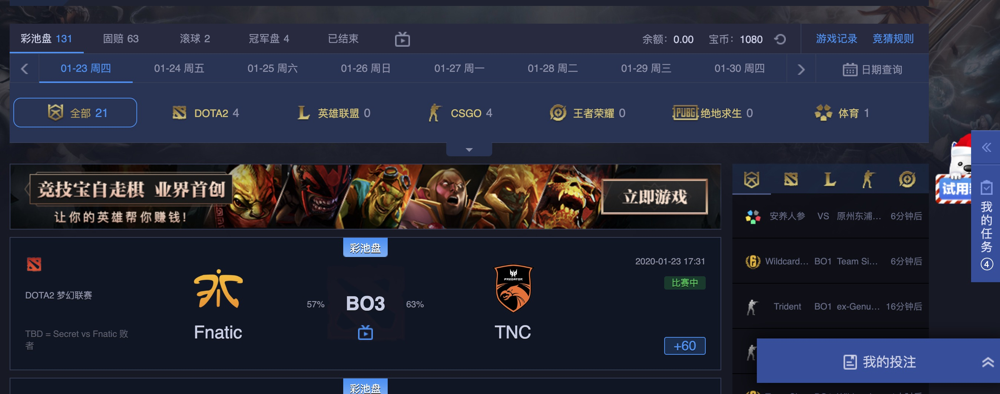

[](https://www.python.org/downloads/)


- 该项目会长期更新。
- 欢迎提issue，维护者看到后都会积极回答。

## 快速开始 :octocat:

1.项目介绍

```
 竞技宝  一个电竞博彩网站  网址：https://jjb.games/s?lolignb
 每日签到送B币 可以在英雄联盟比赛期间下注玩
 随手写了个脚本 可挂在服务器上定时每日跑一次
 通过server酱公众号服务  绑定微信 推送签到相关信息
 绑定教程网址：http://sc.ftqq.com/?c=wechat&a=bind
```


2.填写必要相关信息

- 运行 fightbaby.py  
 

```
填写主函数必要的用户相关信息  用户名/密码
若网站域名变动 需调整更改 changeparam字段
push 函数可填写绑定微信后的专属api 接收返回提醒
```

2.签到

```
设置成功后，会获取当前账号相关信息 自动进行每日签到
并对无门槛的相关任务自动完成
返回签到提醒信息 和当前账号资产
```


3.效果图




